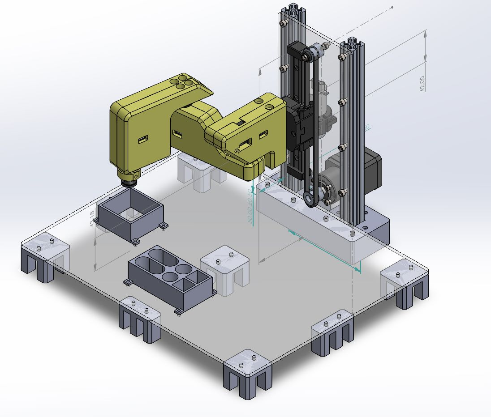
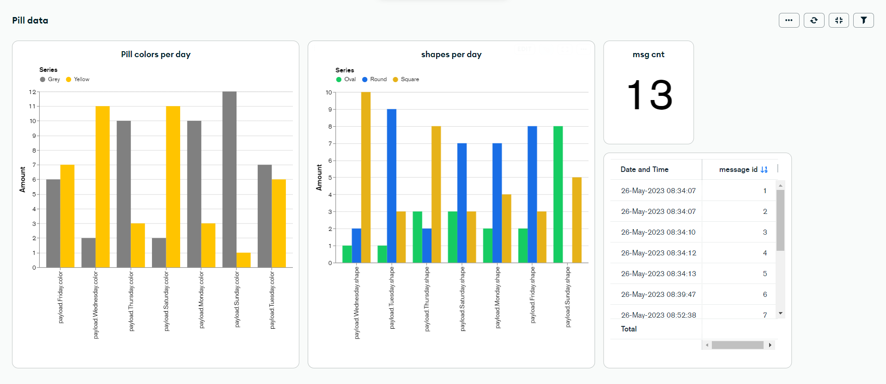

# Medicine Sorting System

This repository contains the code and documentation for the Medicine Sorting System, a project developed as part of the Erasmus+ Blended Intensive Program. The project involved a collaboration between students from FH Technikum Wien, Lapin AMK, and Fontys ICT.

## Overview

The Medicine Sorting System is an advanced solution designed to streamline the medicine sorting process in the pharmaceutical industry. By leveraging machine learning algorithms and robotics technology, the system detects various medical conditions and automates the sorting and organization of medicines.

## Features

- Utilizes a Jetson Nano with machine learning capabilities for accurate patient condition detection.
- Integrates a Node-RED application to collect and send data to a MongoDB database.
- Connects a HMI dashboard to the MongoDB database, providing visualizations of the collected data.
- Features a Morobot with expandable code, serving as the sorting robot for efficient medicine collection and placement.
- Jetson Nano performs condition scanning and sends MQTT messages to the system.
- ESP32 forwards MQTT messages from the Jetson Nano to an Arduino ATMega using UART communication.
- Morobot gets controlled by the Arduino ATMega and fills the medicine box with the correct pills.
- Utilizes a suction pump mechanism in the Morobot to pick up and drop pills into the designated medicine box.

## Equipment and Flow

The Medicine Sorting System consists of the following components:

- Jetson Nano: Responsible for scanning patient conditions and sending MQTT messages.
- ESP32: Acts as a bridge, forwarding MQTT messages from the Jetson Nano to the Arduino ATMega via UART communication.
- Arduino ATMega: Receives MQTT messages from the ESP32 and controls the Morobot's actions.
- Morobot: Gets controlled by the Arduino ATMega and accurately fills the medicine box using a suction pump mechanism. 
- Additionally, a Node-RED application runs in the background, collecting data and publishing it to a MongoDB database. The MongoDB visualization tool creates a HMI dashboard for monitoring and analysis.

## Acknowledgements

We would like to express our gratitude to the Erasmus+ Blended Intensive Program for providing us with the opportunity to collaborate on this innovative project. Additionally, we extend our thanks to FH Technikum Wien, Lapin AMK, and Fontys ICT for their valuable contributions and support throughout the development process.
